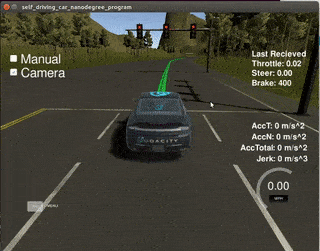
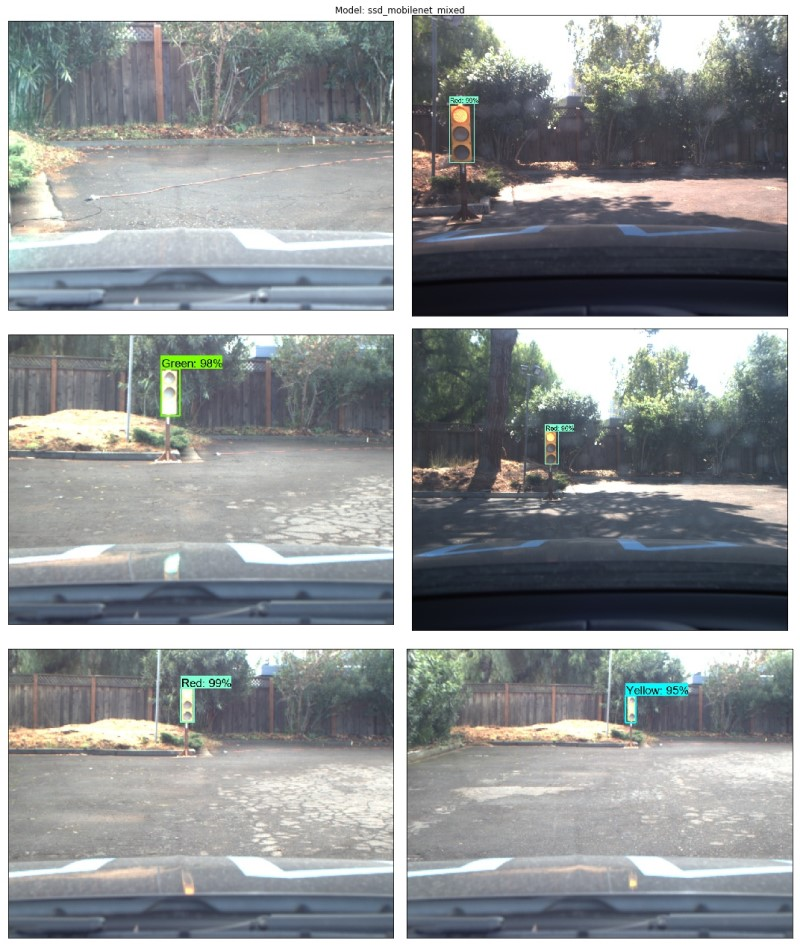
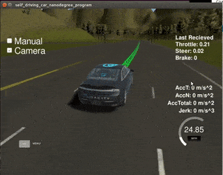
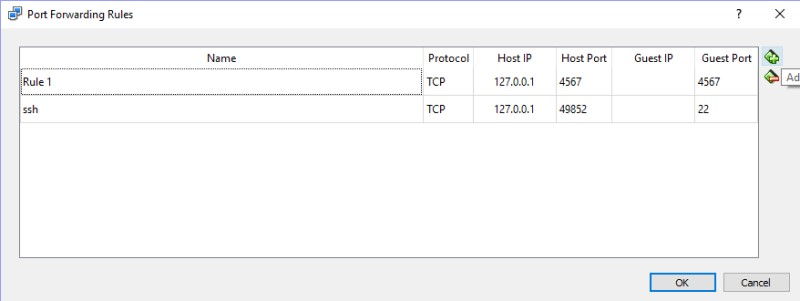

# Udacity Self-Driving Car Nanodegree: System Integration <!-- omit in toc --> 
[](http://www.udacity.com/drive) <!-- omit in toc -->



Team **SuperAI** Members <!-- omit in toc -->
---

* [Aviral Singh](https://github.com/aviralksingh) (aviralksingh@gmail.com)
* [Marco Marasca](https://github.com/Az4z3l) (marascamarco@gmail.com)
* [Thomas Brakel](https://github.com/TBrakel77) (twbrakel@gmail.com)
* [Bilal Elsheemy](https://github.com/bilalelsheemy) (belaalelsheemy93@gmail.com)
* [Chuqiao Dong](https://github.com/chd415) (chd415@lehigh.edu)

## Table of Contents <!-- omit in toc -->
- [Overview](#overview)
- [ROS Nodes](#ros-nodes)
  - [Traffic Light Detection](#traffic-light-detection)
  - [Waypoint Updater](#waypoint-updater)
  - [Drive by Wire Controller](#drive-by-wire-controller)
- [Getting Started](#getting-started)
  - [Native Installation](#native-installation)
  - [VM Installation](#vm-installation)
  - [Docker Installation](#docker-installation)
  - [WSL Installation](#wsl-installation)
  - [Running the Project](#running-the-project)

Overview
---

This repository contains the code for the final project of the [Udacity Self-Driving Car Nanodegree](https://www.udacity.com/course/self-driving-car-engineer-nanodegree--nd013): Programming a Real Self-Driving Car developed by the team **SuperAI**.

It consists of a set of components implemented and deployed as [ROS](http://www.ros.org/) nodes that work together in order to drive **Carla** ([Udacity's](https://udacity.com) self-driving car) autonomously around a test track. In particular the project tackles 3 different sub-system of the vehicle: ***Perception***, ***Planning*** and ***Control***:


*System Architecture*

Among the components depicted in the picture above, the team focused on the implementation and integration of the following 3 nodes:

* [Traffic Light Detection](#traffic-light-detection): Part of the *perception* sub-system, the node takes care of detecting traffic lights as well as classifying their state
* [Waypoint Updater](#waypoint-updater): Part of the *planning* sub-system, takes care of generating a trajectory (as a set of waypoints with their respective target velocities) taking into account the detected traffic lights in the environment
* [Drive by Wire Controller](#drive-by-wire-controller): Part of the *control* sub-system, takes care of translating the [Twist Messages](https://docs.ros.org/api/geometry_msgs/html/msg/Twist.html) generated by the [waypoint follower](./ros/src/waypoint_follower) into throttle, break and steering values

ROS Nodes
---

### [Traffic Light Detection](https://github.com/Az4z3l/CarND-Traffic-Light-Detection)

The [traffic light detection node](./ros/src/tl_detector) is in charge of the part of the perception sub-system that needs to detect incoming traffic lights and their state. In this simple implementation the detector computes the position (in term of waypoint index) of the upcoming traffic light if its state is currently detected as a red light, so that the [waypoint updater](#waypoint-updater) can take the upcoming red light in generating a trajectory.

The node subscribes to 3 topics:

* **/base_waypoints:** The topic publishes the waypoints that the car should follow (in this project it contains all the waypoints)
* **/vehicle/traffic_lights:** The topic publishes the position of the traffic lights are and their state (only in simulator)
* **/current_pose:** The topic publishes the current position of the vehicle
* **/image_color:** The topic publishes the RGB image captured by the camera

With the information of the *current pose* and the *traffic lights* the node computes the distance to the closest traffic light and if within a reasonable range runs a **detection** on the whole image to establish the traffic light state (if any). If a traffic light is detected and its state is red the node publishes (topic **/traffic_waypoint**) the waypoint index at which the traffic light is detected.

*Note: the simulator publishes the traffic light state, so in order to avoid running the real detector (e.g. for testing) is it possible to disable the detector, setting the value of the `use_light_state` to `True` in the [sim_traffic_light_config.yaml](./ros/src/tl_detector/sim_traffic_light_config.yaml) configuration file.*
 
The [detector](./ros/src/tl_detector/light_classification/tl_classifier.py) uses [Tensorflow](https://tensorflow.org) to run a variant of a [Single Shot MultiBox Detector](https://arxiv.org/abs/1512.02325) that uses as feature extractor [MobileNetV2](https://arxiv.org/abs/1801.04381). The model weights used by the included graph are pre-trained on the [COCO Dataset](http://cocodataset.org) that already contains the traffic light category and provided by the [Tensorflow Object Detection API](https://github.com/tensorflow/models/blob/master/research/object_detection).

The model was *fine-tuned* on 3 different classes corresponding to the various states of the traffic lights, in order to fold the object detection, localization and classification into a single **end-to-end model**.

The model was fine-tuned for the task at end using labelled images from various sources, including the [Udacity Simulator](https://github.com/udacity/CarND-Capstone/releases), the [Udacity Training Bag](https://s3-us-west-1.amazonaws.com/udacity-selfdrivingcar/traffic_light_bag_file.zip) and images captured by Carla from real runs at the test lot of Udacity (Download [here](https://drive.google.com/file/d/0B2_h37bMVw3iYkdJTlRSUlJIamM/view?usp=sharing)). Note that we deploy a single model that runs for both the simulator and for the test lot, as the model generalized well enough to recognize various images.

The images used for training were labelled semi-automatically first running a pre-trained high accuracy object detection model ([Faster RCNN](https://arxiv.org/abs/1506.01497)) and then manually validated using [LabelImg](https://github.com/tzutalin/labelImg). The final dataset used for both training, validation and testing can be downloaded from [here](https://drive.google.com/open?id=1NXqHTnjVC1tPjAB5DajGc30uWk5VPy7C).

Various models were fine-tuned and tested, for more details about the whole process and the evaluation results see the dedicated [Traffic Light Detection Repository](https://github.com/Az4z3l/CarND-Traffic-Light-Detection).



### Waypoint Updater

The waypoint updater node takes care of generating a trajectory in terms of waypoints so that the [waypoint follower](./ros/src/waypoint_follower) can generate the correct [Twist Messages](https://docs.ros.org/api/geometry_msgs/html/msg/Twist.html) consumed by the [DBW Node](./ros/src/twist_controller/dbw_node.py). Each of the waypoints are generated from a subset of the overall set of waypoints provided according to the vehicle position (published in the `/current_pose` topic). For each waypoint a target velocity is generated to smoothen the transition between each waypoint.

The node also subscribes to the `/traffic_waypoint` topic published by the [Traffic Light Detection Node](#traffic-light-detection) in order to adjust the waypoints in the presence of a red light:



Finally the node publishes the list of waypoints ahead of the vehicle to the `/final_waypoints` topic.

### Drive by Wire Controller

Udacity's self-driving car Carla is equipped with a drive-by-wire (DBW) system, meaning the throttle, brake, and steering have electronic control. 

The DBW Node is responsible for controlling the vehicle, sending the correct commands for throttle, brake and steering. The node subscribes to the `/current_velocity` topic along with the `/twist_cmd` topic to receive target linear and angular velocities (generated by the waypoint follower node from the waypoints published by the [waypoint updater](#waypoints-updater)). 

The implementation uses a [low pass filter](./ros/src/twist_controller/lowpass.py) on the velocity to smoothen the noise and uses a PID controller to control the throttle. A separate controller is used for [steering](./ros/src/twist_controller/yaw_controller.py).

This node publishes throttle, brake, and steering commands to the `/vehicle/throttle_cmd`, `/vehicle/brake_cmd`, and `/vehicle/steering_cmd topics`.

Getting Started
---

### Native Installation

* Be sure that your workstation is running Ubuntu 16.04 Xenial Xerus or Ubuntu 14.04 Trusty Tahir. [Ubuntu downloads can be found here](https://www.ubuntu.com/download/desktop).

* Follow these instructions to install ROS
  * [ROS Kinetic](http://wiki.ros.org/kinetic/Installation/Ubuntu) if you have Ubuntu 16.04.
  * [ROS Indigo](http://wiki.ros.org/indigo/Installation/Ubuntu) if you have Ubuntu 14.04.
  
  Note: If using a server without GUI support ROS can be installed using the `ROS Base` option: 

    ```sh
    sudo apt-get install ros-kinetic-ros-base
    ```

    In this case you will need to later add the cv_bridge module:

    ```sh
    sudo apt-get install ros-(ROS version name)-cv-bridge
    ```
* Install [Dataspeed DBW](https://bitbucket.org/DataspeedInc/dbw_mkz_ros), use the [One Line SDK Install (binary)](https://bitbucket.org/DataspeedInc/dbw_mkz_ros/src/81e63fcc335d7b64139d7482017d6a97b405e250/ROS_SETUP.md) to install the SDK on a workstation that already has ROS installed.


* Download the [Udacity Simulator](https://github.com/udacity/CarND-Capstone/releases).

### VM Installation

If using a Virtual Machine to install Ubuntu, use the following configuration as minimum:

* 2 CPU
* 2 GB system memory
* 25 GB of free hard drive space

Udacity provides a [VM Disk Image](https://s3-us-west-1.amazonaws.com/udacity-selfdrivingcar/Udacity_VM_Base_V1.0.0.zip) that has ROS and [Dataspeed DBW](https://bitbucket.org/DataspeedInc/dbw_mkz_ros) already installed, so you can skip the next two steps if you are using it.

Note: If running in a VM port **4567** needs to be forwarded, for example in Virtual Box:

  1. First open up Oracle VM VirtualBox
  2. Click on the default session and select settings.
  3. Click on Network, and then Advanced.
  4. Click on Port Forwarding
  5. Click on the green plus, adds new port forwarding rule.
  6. Add a rule that assigns 4567 as both the host port and guest Port, as in the screenshot:

  

### Docker Installation
[Install Docker](https://docs.docker.com/engine/installation/)

Build the docker container
```bash
docker build . -t capstone
```

Run the docker file
```bash
docker run -p 4567:4567 -v $PWD:/capstone -v /tmp/log:/root/.ros/ --rm -it capstone
```

### WSL Installation

ROS can be installed in the [Windows Subsystem for Linux](https://docs.microsoft.com/en-us/windows/wsl/install-win10), simply install Ubuntu Xenial 16.04 and follow the [Native Installation](#native-installation) instructions selected the `ROS Base` installation option.

To install multiple versions of Ubuntu (in case you already have a different version of Ubuntu) use [LxRunOffline](https://github.com/DDoSolitary/LxRunOffline).

### Running the Project

1. Clone the project repository
    ```bash
    git clone https://github.com/aviralksingh/CarND-Capstone.git
    ```

2. Install python dependencies
    ```bash
    cd CarND-Capstone
    pip install -r requirements.txt
    ```
    Note: If you run into `IndexError: tuple index out of range` please update Pillow: `sudo apt-get install --upgrade Pillow`

3. Make and run styx
    ```bash
    cd ros
    catkin_make
    source devel/setup.sh
    roslaunch launch/styx.launch
    ```
4. Run the simulator
